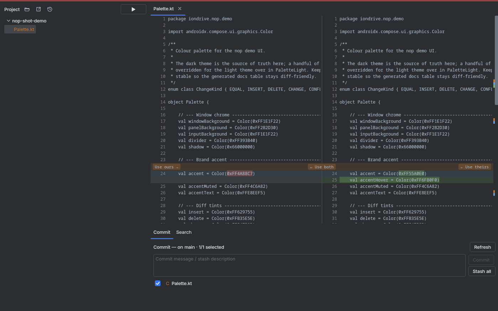

# nop

Minimalist cross platform editor and change reviewer built on Jetbrains Compose

## Install

**Linux** — `./scripts/install.sh`. This builds the distributable and drops a `.desktop`
entry into `~/.local/share/applications/`, so "nop" appears in your application menu
under Development. Re-run the script to rebuild in place.

**macOS** — `./gradlew packageDmg` produces a `.dmg` under
`build/compose/binaries/main/dmg/`; open it and drag `nop.app` into `/Applications`.
You must build on a Mac (jpackage can't cross-compile).

**Windows** — `./gradlew packageMsi` produces an `.msi` under
`build\compose\binaries\main\msi\`; double-click it to install. You must build on
Windows.

## Shortcuts

Select a file or directory in the project tree, then:
- `Delete` — remove it from disk (asks for confirmation first)
- `H` — open a tab showing its git history

Ctrl click on an element in a file to jump to source.

<!-- screenshot -->

*Captured 2026-05-22 19:04:07 — light & dark mode toggled via the header button*
<!-- screenshot -->
